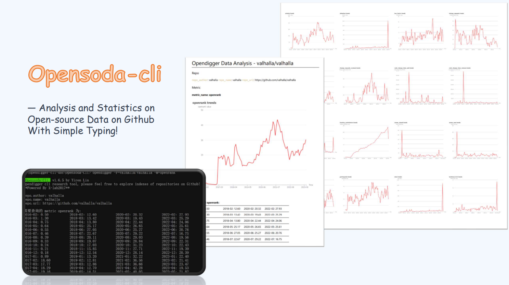

<div align="center">
<h1 >
  <br/>Opensoda-cli
</h1>


[](README-CN.md)



<div align='left'>

This tool is developed by **LazyAnalysis** group in [OpenSODA](https://competition.atomgit.com/competitionInfo?id=bc6603e0b8bf11ed804e6b78b4426d45) competition.

<div align="center">


<div align='left'>

## About this project

A terminal tool to have a easy view of metrics of popular github repositories. Apis in this tool are supported by [`X-lab2017`](https://github.com/X-lab2017).

This project is powered🚀 by `create-node-cli`, and its project site: https://www.npmjs.com/package/create-node-cli

Node version: 18.17.0

To ensure smooth execution of this TypeScript project, it's recommended to run `tsc --watch` in a separate terminal to listen for project changes before executing the project. If you haven't installed TypeScript yet, you'll need to run `npm install typescript -g` to install it.

## Install

This repository uses pnpm as its package manager. Before starting to use it, make sure you have installed pnpm, which can be viewed by command `pnpm -v`, and if pnpm is not installed, just type in `npm i pnpm -g` to install it!

To install this tool, run `pnpm install` and `npm link` under the sorce code folder.

```bash
pnpm install
npm link
```

or you can just install by npm -g:

```bash
npm i opensoda-cli -g
```

## Usage

Run `opendigger -h` for detail.

basic usage template:

#### `opendigger -r <author/repo-name> [-m <metric> -t <time> -d]`

here are some examples:

You can get `openrank` of [`valhalla/valhalla`](https://github.com/valhalla/valhalla) by typing in terminal:

```bash
opendigger -r=valhalla/valhalla -m=openrank
```


If you want to explore an another repo, just type in `opendigger -r <author/repo_name> -m openrank` to get the information. Here `-r` indicates a repository url, `-m` indicates the metric to be used.

**For more information of metrics**, please visit https://github.com/X-lab2017/open-digger#metrics-or-indices-usage. Hopefully you will be excited at the wonderful world. And I'm very appreciated of you to contribute to it!

You can also **export report to local**, just add `-d` choice. Have a try of

```bash
opendigger -r=valhalla/valhalla -m=openrank -d
```


the exported markdown includes picture generated by echarts and data you queried. The report and picture will be stored at `./opendigger-output/`


What's more, you can specify a time to search one metric at specific time. This command

```bash
opendigger -r=valhalla/valhalla -m=openrank -t=2022-10
```

will return the `activity` metric of repository `valhalla/valhalla` in `2022-10` and save the result.


Searching all of the metrics at a specific time is supported, just without specifying metric argument. Try command

```bash
opendigger -r=valhalla/valhalla -t=2022-10
```


Now it is supported to search all of the metrics of all months:
```bash
opendigger -r=valhalla/valhalla
```


Searching all of the metrics of all months, and store the report in markdown:
```bash
opendigger -r=valhalla/valhalla -d
```


the result will be very exciting!

### Online experience 😋
To help experience this tool with no difficulties, we developed a website. This is how it looks like now:


More features are coming soon~
