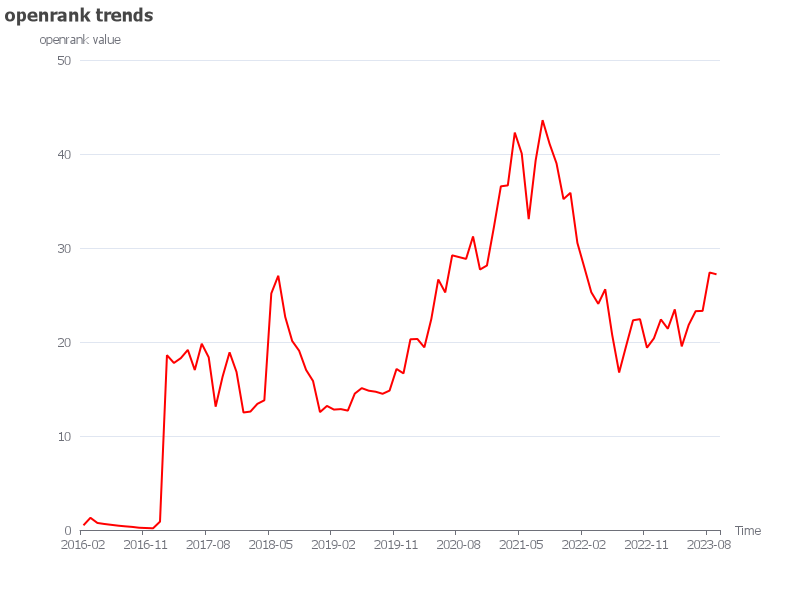
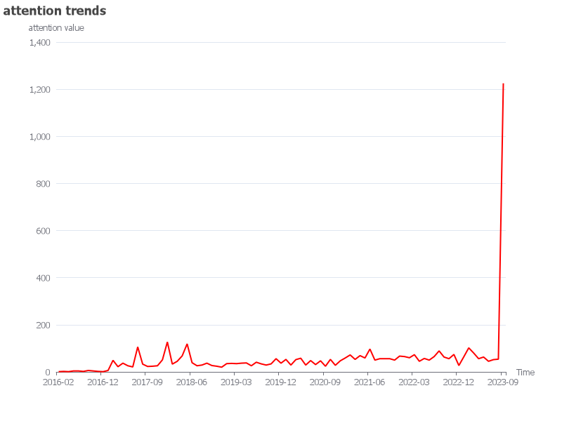
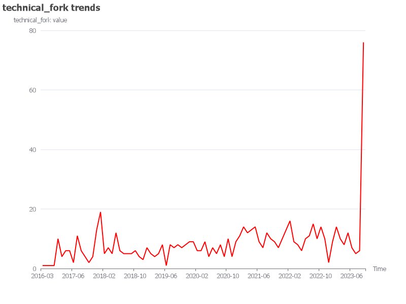
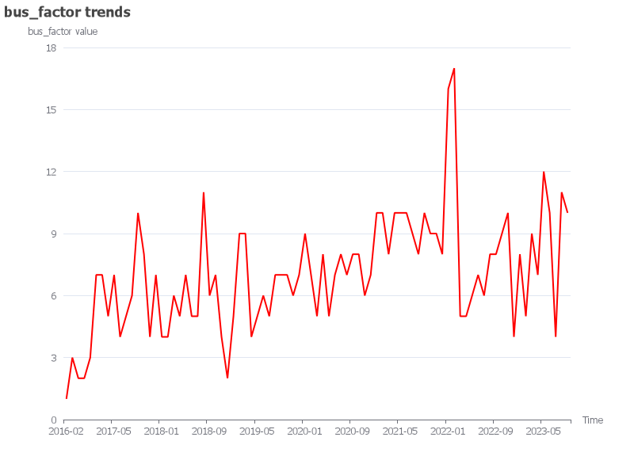
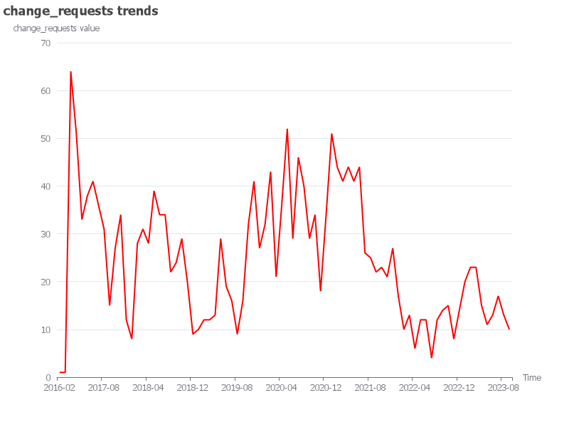
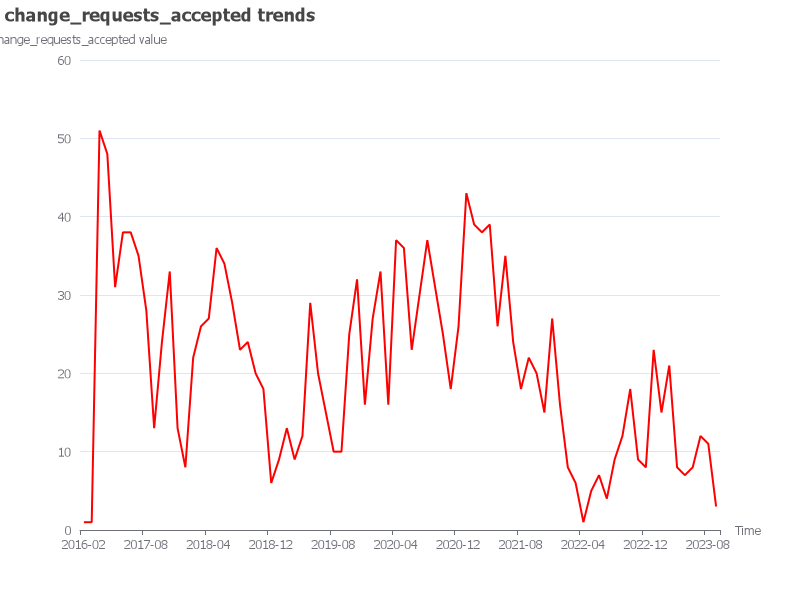

# Opendigger Data Analysis - valhalla/valhalla
### Repo
`repo_author`: valhalla
`repo_name`: valhalla
`repo_url`: https://github.com/valhalla/valhalla

### Metrics
#### metric_name: openrank

| Dates and openrank: | | | |
| --- | --- | --- | --- |
|2016-02: 0.5|2018-02: 12.6|2020-02: 20.32|2022-02: 27.93|
|2016-03: 1.3|2018-03: 13.42|2020-03: 19.43|2022-03: 25.29|
|2016-04: 0.75|2018-04: 13.8|2020-04: 22.44|2022-04: 24.06|
|2016-05: 0.64|2018-05: 25.17|2020-05: 26.65|2022-05: 25.61|
|2016-06: 0.55|2018-06: 27.05|2020-06: 25.27|2022-06: 20.76|
|2016-07: 0.46|2018-07: 22.67|2020-07: 29.22|2022-07: 16.75|
|2016-08: 0.39|2018-08: 20.11|2020-08: 29.03|2022-08: 19.56|
|2016-09: 0.33|2018-09: 19.07|2020-09: 28.84|2022-09: 22.31|
|2016-10: 0.24|2018-10: 17.03|2020-10: 31.23|2022-10: 22.43|
|2016-11: 0.21|2018-11: 15.85|2020-11: 27.71|2022-11: 19.39|
|2016-12: 0.18|2018-12: 12.54|2020-12: 28.14|2022-12: 20.39|
|2017-01: 0.89|2019-01: 13.2|2021-01: 32.22|2023-01: 22.4|
|2017-02: 18.6|2019-02: 12.81|2021-02: 36.56|2023-02: 21.41|
|2017-03: 17.77|2019-03: 12.86|2021-03: 36.66|2023-03: 23.47|
|2017-04: 18.29|2019-04: 12.7|2021-04: 42.28|2023-04: 19.53|
|2017-05: 19.16|2019-05: 14.51|2021-05: 40.05|2023-05: 21.82|
|2017-06: 17.02|2019-06: 15.09|2021-06: 33.07|2023-06: 23.28|
|2017-07: 19.82|2019-07: 14.82|2021-07: 39.32|2023-07: 23.31|
|2017-08: 18.37|2019-08: 14.71|2021-08: 43.6|2023-08: 27.39|
|2017-09: 13.12|2019-09: 14.49|2021-09: 41.09|2023-09: 27.2|
|2017-10: 16.32|2019-10: 14.83|2021-10: 39|
|2017-11: 18.9|2019-11: 17.13|2021-11: 35.2|
|2017-12: 16.81|2019-12: 16.66|2021-12: 35.87|
|2018-01: 12.5|2020-01: 20.29|2022-01: 30.54|
#### metric_name: activity

| Dates and activity: | | | |
| --- | --- | --- | --- |
|2016-02: 4.65|2018-07: 77.01|2020-05: 124.46|2022-03: 82.88|
|2016-03: 6.71|2018-08: 73.49|2020-06: 104.8|2022-04: 65.47|
|2016-04: 5.15|2018-09: 68.76|2020-07: 156.43|2022-05: 63.28|
|2016-10: 2.83|2018-10: 60.59|2020-08: 139.09|2022-06: 51.6|
|2017-01: 10.72|2018-11: 46.01|2020-09: 148.39|2022-07: 63.43|
|2017-02: 120.6|2018-12: 21.08|2020-10: 131.45|2022-08: 81.21|
|2017-03: 76.71|2019-01: 46.81|2020-11: 102.72|2022-09: 96.43|
|2017-04: 63.75|2019-02: 46.92|2020-12: 136.13|2022-10: 83.53|
|2017-05: 84.02|2019-03: 51.75|2021-01: 183.59|2022-11: 71.01|
|2017-06: 65.52|2019-04: 52.61|2021-02: 206.06|2022-12: 62.16|
|2017-07: 93.14|2019-05: 90.95|2021-03: 193.47|2023-01: 86.93|
|2017-08: 78.82|2019-06: 69.76|2021-04: 201.84|2023-02: 93.07|
|2017-09: 45.98|2019-07: 65.48|2021-05: 161.66|2023-03: 132.35|
|2017-10: 73.06|2019-08: 45.55|2021-06: 140.62|2023-04: 65.42|
|2017-11: 66.55|2019-09: 61.94|2021-07: 137.18|2023-05: 83.07|
|2017-12: 32.61|2019-10: 87.41|2021-08: 163.4|2023-06: 83.58|
|2018-01: 35.64|2019-11: 114.71|2021-09: 137.15|2023-07: 97.51|
|2018-02: 52.85|2019-12: 92.15|2021-10: 145|2023-08: 108|
|2018-03: 62.99|2020-01: 140.12|2021-11: 151.44|2023-09: 86.48|
|2018-04: 58.83|2020-02: 110.19|2021-12: 132.24|
|2018-05: 109.12|2020-03: 107.13|2022-01: 107.87|
|2018-06: 105.29|2020-04: 128.76|2022-02: 76.22|
#### metric_name: attention

| Dates and attention: | | | |
| --- | --- | --- | --- |
|2016-02: 1|2018-02: 33|2020-01: 53|2021-12: 67|
|2016-03: 2|2018-03: 45|2020-02: 29|2022-01: 65|
|2016-05: 1|2018-04: 68|2020-03: 52|2022-02: 60|
|2016-06: 4|2018-05: 119|2020-04: 58|2022-03: 73|
|2016-07: 4|2018-06: 39|2020-05: 29|2022-04: 45|
|2016-08: 2|2018-07: 26|2020-06: 48|2022-05: 57|
|2016-09: 6|2018-08: 29|2020-07: 31|2022-06: 50|
|2016-10: 4|2018-09: 37|2020-08: 47|2022-07: 65|
|2016-11: 2|2018-10: 27|2020-09: 24|2022-08: 89|
|2016-12: 1|2018-11: 24|2020-10: 53|2022-09: 63|
|2017-01: 6|2018-12: 20|2020-11: 28|2022-10: 56|
|2017-02: 49|2019-01: 35|2020-12: 47|2022-11: 74|
|2017-03: 22|2019-02: 36|2021-01: 59|2022-12: 27|
|2017-04: 37|2019-03: 35|2021-02: 72|2023-01: 64|
|2017-05: 26|2019-04: 37|2021-03: 53|2023-02: 102|
|2017-06: 21|2019-05: 38|2021-04: 69|2023-03: 80|
|2017-07: 106|2019-06: 26|2021-05: 59|2023-04: 56|
|2017-08: 33|2019-07: 41|2021-06: 97|2023-05: 63|
|2017-09: 23|2019-08: 34|2021-07: 50|2023-06: 45|
|2017-10: 24|2019-09: 29|2021-08: 56|2023-07: 52|
|2017-11: 26|2019-10: 34|2021-09: 56|2023-08: 54|
|2017-12: 51|2019-11: 56|2021-10: 56|2023-09: 1225|
|2018-01: 127|2019-12: 37|2021-11: 50|
#### metric_name: stars

| Dates and stars: | | | |
| --- | --- | --- | --- |
|2016-02: 1|2018-04: 58|2020-03: 40|2022-02: 28|
|2016-05: 1|2018-05: 95|2020-04: 40|2022-03: 55|
|2016-06: 4|2018-06: 27|2020-05: 21|2022-04: 29|
|2016-07: 4|2018-07: 16|2020-06: 34|2022-05: 45|
|2016-09: 4|2018-08: 19|2020-07: 21|2022-06: 30|
|2016-10: 2|2018-09: 27|2020-08: 31|2022-07: 43|
|2016-11: 2|2018-10: 15|2020-09: 16|2022-08: 59|
|2016-12: 1|2018-11: 16|2020-10: 33|2022-09: 43|
|2017-01: 6|2018-12: 14|2020-11: 20|2022-10: 28|
|2017-02: 29|2019-01: 21|2020-12: 29|2022-11: 54|
|2017-03: 14|2019-02: 26|2021-01: 37|2022-12: 23|
|2017-04: 25|2019-03: 27|2021-02: 44|2023-01: 46|
|2017-05: 14|2019-04: 27|2021-03: 29|2023-02: 74|
|2017-06: 17|2019-05: 22|2021-04: 43|2023-03: 60|
|2017-07: 84|2019-06: 24|2021-05: 31|2023-04: 40|
|2017-08: 21|2019-07: 25|2021-06: 79|2023-05: 39|
|2017-09: 15|2019-08: 20|2021-07: 36|2023-06: 31|
|2017-10: 20|2019-09: 13|2021-08: 32|2023-07: 42|
|2017-11: 18|2019-10: 20|2021-09: 36|2023-08: 42|
|2017-12: 25|2019-11: 40|2021-10: 37|2023-09: 1073|
|2018-01: 89|2019-12: 19|2021-11: 36|
|2018-02: 23|2020-01: 35|2021-12: 47|
|2018-03: 31|2020-02: 17|2022-01: 39|
#### metric_name: technical_fork

| Dates and technical_fork: | | | |
| --- | --- | --- | --- |
|2016-03: 1|2018-08: 5|2020-06: 7|2022-04: 8|
|2016-08: 1|2018-09: 5|2020-07: 5|2022-05: 6|
|2016-09: 1|2018-10: 6|2020-08: 8|2022-06: 10|
|2016-10: 1|2018-11: 4|2020-09: 4|2022-07: 11|
|2017-02: 10|2018-12: 3|2020-10: 10|2022-08: 15|
|2017-03: 4|2019-01: 7|2020-11: 4|2022-09: 10|
|2017-04: 6|2019-02: 5|2020-12: 9|2022-10: 14|
|2017-05: 6|2019-03: 4|2021-01: 11|2022-11: 10|
|2017-06: 2|2019-04: 5|2021-02: 14|2022-12: 2|
|2017-07: 11|2019-05: 8|2021-03: 12|2023-01: 9|
|2017-08: 6|2019-06: 1|2021-04: 13|2023-02: 14|
|2017-09: 4|2019-07: 8|2021-05: 14|2023-03: 10|
|2017-10: 2|2019-08: 7|2021-06: 9|2023-04: 8|
|2017-11: 4|2019-09: 8|2021-07: 7|2023-05: 12|
|2017-12: 13|2019-10: 7|2021-08: 12|2023-06: 7|
|2018-01: 19|2019-11: 8|2021-09: 10|2023-07: 5|
|2018-02: 5|2019-12: 9|2021-10: 9|2023-08: 6|
|2018-03: 7|2020-01: 9|2021-11: 7|2023-09: 76|
|2018-04: 5|2020-02: 6|2021-12: 10|
|2018-05: 12|2020-03: 6|2022-01: 13|
|2018-06: 6|2020-04: 9|2022-02: 16|
|2018-07: 5|2020-05: 4|2022-03: 9|
#### metric_name: participants

| Dates and participants: | | | |
| --- | --- | --- | --- |
|2016-02: 3|2018-07: 22|2020-05: 27|2022-03: 24|
|2016-03: 3|2018-08: 25|2020-06: 26|2022-04: 22|
|2016-04: 4|2018-09: 21|2020-07: 40|2022-05: 22|
|2016-10: 2|2018-10: 22|2020-08: 34|2022-06: 14|
|2017-01: 4|2018-11: 16|2020-09: 33|2022-07: 23|
|2017-02: 28|2018-12: 9|2020-10: 29|2022-08: 29|
|2017-03: 19|2019-01: 18|2020-11: 25|2022-09: 33|
|2017-04: 16|2019-02: 16|2020-12: 29|2022-10: 27|
|2017-05: 24|2019-03: 19|2021-01: 46|2022-11: 26|
|2017-06: 17|2019-04: 17|2021-02: 46|2022-12: 21|
|2017-07: 23|2019-05: 27|2021-03: 36|2023-01: 27|
|2017-08: 25|2019-06: 19|2021-04: 46|2023-02: 30|
|2017-09: 17|2019-07: 21|2021-05: 38|2023-03: 37|
|2017-10: 24|2019-08: 18|2021-06: 31|2023-04: 23|
|2017-11: 18|2019-09: 21|2021-07: 30|2023-05: 35|
|2017-12: 13|2019-10: 28|2021-08: 39|2023-06: 34|
|2018-01: 13|2019-11: 28|2021-09: 36|2023-07: 25|
|2018-02: 18|2019-12: 25|2021-10: 38|2023-08: 41|
|2018-03: 19|2020-01: 35|2021-11: 40|2023-09: 36|
|2018-04: 15|2020-02: 27|2021-12: 35|
|2018-05: 28|2020-03: 21|2022-01: 37|
|2018-06: 21|2020-04: 30|2022-02: 28|
#### metric_name: inactive_contributors

| Dates and inactive_contributors: | | | |
| --- | --- | --- | --- |
|2016-08: 1|2018-06: 28|2020-04: 51|2022-02: 96|
|2016-09: 2|2018-07: 28|2020-05: 54|2022-03: 100|
|2016-10: 2|2018-08: 28|2020-06: 55|2022-04: 102|
|2016-11: 2|2018-09: 28|2020-07: 58|2022-05: 107|
|2016-12: 2|2018-10: 29|2020-08: 58|2022-06: 110|
|2017-01: 2|2018-11: 34|2020-09: 58|2022-07: 113|
|2017-02: 1|2018-12: 39|2020-10: 60|2022-08: 119|
|2017-03: 1|2019-01: 38|2020-11: 64|2022-09: 117|
|2017-04: 1|2019-02: 40|2020-12: 63|2022-10: 116|
|2017-05: 1|2019-03: 44|2021-01: 65|2022-11: 117|
|2017-06: 1|2019-04: 43|2021-02: 66|2022-12: 118|
|2017-07: 1|2019-05: 43|2021-03: 67|2023-01: 119|
|2017-08: 6|2019-06: 42|2021-04: 71|2023-02: 118|
|2017-09: 7|2019-07: 44|2021-05: 71|2023-03: 120|
|2017-10: 11|2019-08: 45|2021-06: 73|2023-04: 127|
|2017-11: 15|2019-09: 44|2021-07: 75|2023-05: 129|
|2017-12: 18|2019-10: 43|2021-08: 81|2023-06: 130|
|2018-01: 21|2019-11: 45|2021-09: 83|2023-07: 134|
|2018-02: 23|2019-12: 47|2021-10: 86|2023-08: 137|
|2018-03: 23|2020-01: 49|2021-11: 89|2023-09: 144|
|2018-04: 24|2020-02: 47|2021-12: 91|
|2018-05: 26|2020-03: 49|2022-01: 91|
#### metric_name: bus_factor

| Dates and bus_factor: | | | |
| --- | --- | --- | --- |
|2016-02: 1|2018-07: 5|2020-05: 5|2022-03: 5|
|2016-03: 3|2018-08: 11|2020-06: 7|2022-04: 5|
|2016-04: 2|2018-09: 6|2020-07: 8|2022-05: 6|
|2016-10: 2|2018-10: 7|2020-08: 7|2022-06: 7|
|2017-01: 3|2018-11: 4|2020-09: 8|2022-07: 6|
|2017-02: 7|2018-12: 2|2020-10: 8|2022-08: 8|
|2017-03: 7|2019-01: 5|2020-11: 6|2022-09: 8|
|2017-04: 5|2019-02: 9|2020-12: 7|2022-10: 9|
|2017-05: 7|2019-03: 9|2021-01: 10|2022-11: 10|
|2017-06: 4|2019-04: 4|2021-02: 10|2022-12: 4|
|2017-07: 5|2019-05: 5|2021-03: 8|2023-01: 8|
|2017-08: 6|2019-06: 6|2021-04: 10|2023-02: 5|
|2017-09: 10|2019-07: 5|2021-05: 10|2023-03: 9|
|2017-10: 8|2019-08: 7|2021-06: 10|2023-04: 7|
|2017-11: 4|2019-09: 7|2021-07: 9|2023-05: 12|
|2017-12: 7|2019-10: 7|2021-08: 8|2023-06: 10|
|2018-01: 4|2019-11: 6|2021-09: 10|2023-07: 4|
|2018-02: 4|2019-12: 7|2021-10: 9|2023-08: 11|
|2018-03: 6|2020-01: 9|2021-11: 9|2023-09: 10|
|2018-04: 5|2020-02: 7|2021-12: 8|
|2018-05: 7|2020-03: 5|2022-01: 16|
|2018-06: 5|2020-04: 8|2022-02: 17|
#### metric_name: issues_new

| Dates and issues_new: | | | |
| --- | --- | --- | --- |
|2016-02: 1|2018-07: 26|2020-05: 8|2022-03: 14|
|2016-03: 1|2018-08: 19|2020-06: 15|2022-04: 9|
|2016-04: 1|2018-09: 22|2020-07: 18|2022-05: 16|
|2016-10: 1|2018-10: 27|2020-08: 16|2022-06: 7|
|2017-01: 9|2018-11: 22|2020-09: 20|2022-07: 11|
|2017-02: 205|2018-12: 7|2020-10: 16|2022-08: 22|
|2017-03: 15|2019-01: 7|2020-11: 10|2022-09: 23|
|2017-04: 14|2019-02: 19|2020-12: 18|2022-10: 23|
|2017-05: 27|2019-03: 15|2021-01: 17|2022-11: 21|
|2017-06: 12|2019-04: 11|2021-02: 35|2022-12: 12|
|2017-07: 26|2019-05: 28|2021-03: 27|2023-01: 36|
|2017-08: 21|2019-06: 8|2021-04: 20|2023-02: 19|
|2017-09: 14|2019-07: 19|2021-05: 26|2023-03: 28|
|2017-10: 20|2019-08: 11|2021-06: 24|2023-04: 17|
|2017-11: 21|2019-09: 18|2021-07: 18|2023-05: 27|
|2017-12: 6|2019-10: 26|2021-08: 20|2023-06: 19|
|2018-01: 9|2019-11: 25|2021-09: 13|2023-07: 20|
|2018-02: 14|2019-12: 22|2021-10: 17|2023-08: 25|
|2018-03: 22|2020-01: 36|2021-11: 19|2023-09: 13|
|2018-04: 25|2020-02: 19|2021-12: 21|
|2018-05: 43|2020-03: 12|2022-01: 23|
|2018-06: 21|2020-04: 13|2022-02: 16|
#### metric_name: issues_closed

| Dates and issues_closed: | | | |
| --- | --- | --- | --- |
|2016-02: 1|2018-08: 7|2020-06: 9|2022-04: 4|
|2016-03: 1|2018-09: 20|2020-07: 15|2022-05: 11|
|2016-04: 1|2018-10: 16|2020-08: 7|2022-06: 4|
|2017-01: 3|2018-11: 15|2020-09: 14|2022-07: 6|
|2017-02: 182|2018-12: 4|2020-10: 10|2022-08: 11|
|2017-03: 16|2019-01: 15|2020-11: 5|2022-09: 15|
|2017-04: 12|2019-02: 9|2020-12: 9|2022-10: 20|
|2017-05: 27|2019-03: 9|2021-01: 14|2022-11: 21|
|2017-06: 11|2019-04: 6|2021-02: 17|2022-12: 7|
|2017-07: 13|2019-05: 18|2021-03: 16|2023-01: 20|
|2017-08: 11|2019-06: 8|2021-04: 14|2023-02: 51|
|2017-09: 4|2019-07: 8|2021-05: 18|2023-03: 16|
|2017-10: 10|2019-08: 6|2021-06: 18|2023-04: 15|
|2017-11: 31|2019-09: 5|2021-07: 12|2023-05: 14|
|2017-12: 3|2019-10: 10|2021-08: 15|2023-06: 17|
|2018-01: 3|2019-11: 18|2021-09: 7|2023-07: 15|
|2018-02: 3|2019-12: 5|2021-10: 11|2023-08: 11|
|2018-03: 13|2020-01: 22|2021-11: 12|2023-09: 7|
|2018-04: 12|2020-02: 20|2021-12: 16|
|2018-05: 22|2020-03: 6|2022-01: 16|
|2018-06: 29|2020-04: 11|2022-02: 12|
|2018-07: 19|2020-05: 10|2022-03: 11|
#### metric_name: issue_comments

| Dates and issue_comments: | | | |
| --- | --- | --- | --- |
|2016-02: 2|2018-07: 62|2020-05: 83|2022-03: 127|
|2016-03: 8|2018-08: 71|2020-06: 97|2022-04: 37|
|2016-04: 5|2018-09: 107|2020-07: 123|2022-05: 106|
|2016-10: 2|2018-10: 72|2020-08: 132|2022-06: 51|
|2017-01: 14|2018-11: 55|2020-09: 104|2022-07: 105|
|2017-02: 213|2018-12: 20|2020-10: 119|2022-08: 114|
|2017-03: 104|2019-01: 58|2020-11: 49|2022-09: 176|
|2017-04: 75|2019-02: 50|2020-12: 132|2022-10: 156|
|2017-05: 165|2019-03: 73|2021-01: 234|2022-11: 127|
|2017-06: 78|2019-04: 29|2021-02: 250|2022-12: 116|
|2017-07: 128|2019-05: 128|2021-03: 267|2023-01: 192|
|2017-08: 113|2019-06: 76|2021-04: 285|2023-02: 178|
|2017-09: 73|2019-07: 60|2021-05: 242|2023-03: 211|
|2017-10: 113|2019-08: 41|2021-06: 219|2023-04: 118|
|2017-11: 87|2019-09: 80|2021-07: 219|2023-05: 178|
|2017-12: 24|2019-10: 86|2021-08: 285|2023-06: 142|
|2018-01: 48|2019-11: 111|2021-09: 185|2023-07: 146|
|2018-02: 68|2019-12: 89|2021-10: 183|2023-08: 114|
|2018-03: 68|2020-01: 145|2021-11: 145|2023-09: 75|
|2018-04: 53|2020-02: 89|2021-12: 165|
|2018-05: 157|2020-03: 64|2022-01: 160|
|2018-06: 125|2020-04: 116|2022-02: 87|
#### metric_name: code_change_lines_add

| Dates and code_change_lines_add: | | | |
| --- | --- | --- | --- |
|2016-02: 70|2018-09: 8344|2020-06: 43552|2022-03: 1351|
|2016-03: 4|2018-10: 21515|2020-07: 10673|2022-04: 36809|
|2017-02: 20388|2018-11: 16149|2020-08: 10557|2022-05: 10779|
|2017-03: 6999|2018-12: 150|2020-09: 13591|2022-06: 918|
|2017-04: 7749|2019-01: 1361|2020-10: 6285|2022-07: 218|
|2017-05: 9675|2019-02: 4102|2020-11: 8049|2022-08: 9191|
|2017-06: 53887|2019-03: 2839|2020-12: 15503|2022-09: 6305|
|2017-07: 20906|2019-04: 3023|2021-01: 20620|2022-10: 3471|
|2017-08: 3958|2019-05: 14209|2021-02: 61195|2022-11: 1607|
|2017-09: 2133|2019-06: 8750|2021-03: 10764|2022-12: 3495|
|2017-10: 4715|2019-07: 2230|2021-04: 13655|2023-01: 3710|
|2017-11: 127776|2019-08: 1667|2021-05: 89731|2023-02: 1469|
|2017-12: 6904|2019-09: 7272|2021-06: 15807|2023-03: 3218|
|2018-01: 6066|2019-10: 21120|2021-07: 7587|2023-04: 3594|
|2018-02: 10444|2019-11: 17394|2021-08: 11924|2023-05: 2234|
|2018-03: 10681|2019-12: 9252|2021-09: 8155|2023-06: 2444|
|2018-04: 8784|2020-01: 10037|2021-10: 339|2023-07: 3894|
|2018-05: 336048|2020-02: 10853|2021-11: 8713|2023-08: 70936|
|2018-06: 91546|2020-03: 7188|2021-12: 10531|2023-09: 7937|
|2018-07: 21676|2020-04: 11381|2022-01: 6248|
|2018-08: 42459|2020-05: 95170|2022-02: 7084|
#### metric_name: code_change_lines_remove

| Dates and code_change_lines_remove: | | | |
| --- | --- | --- | --- |
|2016-02: 2|2018-09: 4992|2020-06: 14922|2022-03: 823|
|2016-03: 4|2018-10: 7680|2020-07: 7132|2022-04: 72|
|2017-02: 5728|2018-11: 14356|2020-08: 4982|2022-05: 885|
|2017-03: 4338|2018-12: 51|2020-09: 6401|2022-06: 460|
|2017-04: 4612|2019-01: 295|2020-10: 2388|2022-07: 305|
|2017-05: 4919|2019-02: 1845|2020-11: 4761|2022-08: 4832|
|2017-06: 15329|2019-03: 952|2020-12: 6506|2022-09: 3281|
|2017-07: 15816|2019-04: 1644|2021-01: 12949|2022-10: 3327|
|2017-08: 1707|2019-05: 12801|2021-02: 12723|2022-11: 759|
|2017-09: 2055|2019-06: 3636|2021-03: 3505|2022-12: 2657|
|2017-10: 1271|2019-07: 900|2021-04: 5139|2023-01: 2511|
|2017-11: 29680|2019-08: 442|2021-05: 4199|2023-02: 950|
|2017-12: 795|2019-09: 5162|2021-06: 6920|2023-03: 5040|
|2018-01: 775|2019-10: 11540|2021-07: 2079|2023-04: 2268|
|2018-02: 7351|2019-11: 9982|2021-08: 1956|2023-05: 1627|
|2018-03: 7442|2019-12: 4831|2021-09: 2158|2023-06: 2348|
|2018-04: 2665|2020-01: 10582|2021-10: 208|2023-07: 3462|
|2018-05: 343728|2020-02: 3650|2021-11: 879|2023-08: 13693|
|2018-06: 60759|2020-03: 4252|2021-12: 8562|2023-09: 705|
|2018-07: 7386|2020-04: 4952|2022-01: 4352|
|2018-08: 7570|2020-05: 14210|2022-02: 3452|
#### metric_name: code_change_lines_sum

| Dates and code_change_lines_sum: | | | |
| --- | --- | --- | --- |
|2016-02: 68|2018-10: 13835|2020-07: 3541|2022-04: 36737|
|2017-02: 14660|2018-11: 1793|2020-08: 5575|2022-05: 9894|
|2017-03: 2661|2018-12: 99|2020-09: 7190|2022-06: 458|
|2017-04: 3137|2019-01: 1066|2020-10: 3897|2022-07: -87|
|2017-05: 4756|2019-02: 2257|2020-11: 3288|2022-08: 4359|
|2017-06: 38558|2019-03: 1887|2020-12: 8997|2022-09: 3024|
|2017-07: 5090|2019-04: 1379|2021-01: 7671|2022-10: 144|
|2017-08: 2251|2019-05: 1408|2021-02: 48472|2022-11: 848|
|2017-09: 78|2019-06: 5114|2021-03: 7259|2022-12: 838|
|2017-10: 3444|2019-07: 1330|2021-04: 8516|2023-01: 1199|
|2017-11: 98096|2019-08: 1225|2021-05: 85532|2023-02: 519|
|2017-12: 6109|2019-09: 2110|2021-06: 8887|2023-03: -1822|
|2018-01: 5291|2019-10: 9580|2021-07: 5508|2023-04: 1326|
|2018-02: 3093|2019-11: 7412|2021-08: 9968|2023-05: 607|
|2018-03: 3239|2019-12: 4421|2021-09: 5997|2023-06: 96|
|2018-04: 6119|2020-01: -545|2021-10: 131|2023-07: 432|
|2018-05: -7680|2020-02: 7203|2021-11: 7834|2023-08: 57243|
|2018-06: 30787|2020-03: 2936|2021-12: 1969|2023-09: 7232|
|2018-07: 14290|2020-04: 6429|2022-01: 1896|
|2018-08: 34889|2020-05: 80960|2022-02: 3632|
|2018-09: 3352|2020-06: 28630|2022-03: 528|
#### metric_name: change_requests

| Dates and change_requests: | | | |
| --- | --- | --- | --- |
|2016-02: 1|2018-09: 24|2020-06: 29|2022-03: 13|
|2016-03: 1|2018-10: 29|2020-07: 46|2022-04: 6|
|2017-02: 64|2018-11: 20|2020-08: 40|2022-05: 12|
|2017-03: 51|2018-12: 9|2020-09: 29|2022-06: 12|
|2017-04: 33|2019-01: 10|2020-10: 34|2022-07: 4|
|2017-05: 38|2019-02: 12|2020-11: 18|2022-08: 12|
|2017-06: 41|2019-03: 12|2020-12: 34|2022-09: 14|
|2017-07: 36|2019-04: 13|2021-01: 51|2022-10: 15|
|2017-08: 31|2019-05: 29|2021-02: 44|2022-11: 8|
|2017-09: 15|2019-06: 19|2021-03: 41|2022-12: 14|
|2017-10: 27|2019-07: 16|2021-04: 44|2023-01: 20|
|2017-11: 34|2019-08: 9|2021-05: 41|2023-02: 23|
|2017-12: 12|2019-09: 16|2021-06: 44|2023-03: 23|
|2018-01: 8|2019-10: 32|2021-07: 26|2023-04: 15|
|2018-02: 28|2019-11: 41|2021-08: 25|2023-05: 11|
|2018-03: 31|2019-12: 27|2021-09: 22|2023-06: 13|
|2018-04: 28|2020-01: 32|2021-10: 23|2023-07: 17|
|2018-05: 39|2020-02: 43|2021-11: 21|2023-08: 13|
|2018-06: 34|2020-03: 21|2021-12: 27|2023-09: 10|
|2018-07: 34|2020-04: 36|2022-01: 17|
|2018-08: 22|2020-05: 52|2022-02: 10|
#### metric_name: change_requests_accepted

| Dates and change_requests_accepted: | | | |
| --- | --- | --- | --- |
|2016-02: 1|2018-09: 24|2020-06: 23|2022-03: 6|
|2016-03: 1|2018-10: 20|2020-07: 30|2022-04: 1|
|2017-02: 51|2018-11: 18|2020-08: 37|2022-05: 5|
|2017-03: 48|2018-12: 6|2020-09: 31|2022-06: 7|
|2017-04: 31|2019-01: 9|2020-10: 25|2022-07: 4|
|2017-05: 38|2019-02: 13|2020-11: 18|2022-08: 9|
|2017-06: 38|2019-03: 9|2020-12: 26|2022-09: 12|
|2017-07: 35|2019-04: 12|2021-01: 43|2022-10: 18|
|2017-08: 28|2019-05: 29|2021-02: 39|2022-11: 9|
|2017-09: 13|2019-06: 20|2021-03: 38|2022-12: 8|
|2017-10: 24|2019-07: 15|2021-04: 39|2023-01: 23|
|2017-11: 33|2019-08: 10|2021-05: 26|2023-02: 15|
|2017-12: 13|2019-09: 10|2021-06: 35|2023-03: 21|
|2018-01: 8|2019-10: 25|2021-07: 24|2023-04: 8|
|2018-02: 22|2019-11: 32|2021-08: 18|2023-05: 7|
|2018-03: 26|2019-12: 16|2021-09: 22|2023-06: 8|
|2018-04: 27|2020-01: 27|2021-10: 20|2023-07: 12|
|2018-05: 36|2020-02: 33|2021-11: 15|2023-08: 11|
|2018-06: 34|2020-03: 16|2021-12: 27|2023-09: 3|
|2018-07: 29|2020-04: 37|2022-01: 16|
|2018-08: 23|2020-05: 36|2022-02: 8|
#### metric_name: change_requests_reviews

| Dates and change_requests_reviews: | | | |
| --- | --- | --- | --- |
|2017-02: 30|2018-11: 5|2020-08: 201|2022-05: 44|
|2017-03: 36|2018-12: 6|2020-09: 250|2022-06: 47|
|2017-04: 36|2019-01: 14|2020-10: 246|2022-07: 32|
|2017-05: 8|2019-02: 15|2020-11: 138|2022-08: 78|
|2017-06: 35|2019-03: 14|2020-12: 251|2022-09: 50|
|2017-07: 79|2019-04: 58|2021-01: 267|2022-10: 86|
|2017-08: 34|2019-05: 63|2021-02: 306|2022-11: 51|
|2017-09: 2|2019-06: 69|2021-03: 374|2022-12: 60|
|2017-10: 17|2019-07: 52|2021-04: 265|2023-01: 54|
|2017-11: 30|2019-08: 15|2021-05: 195|2023-02: 114|
|2017-12: 3|2019-09: 20|2021-06: 125|2023-03: 248|
|2018-01: 14|2019-10: 44|2021-07: 245|2023-04: 63|
|2018-02: 8|2019-11: 151|2021-08: 257|2023-05: 26|
|2018-03: 24|2019-12: 106|2021-09: 175|2023-06: 52|
|2018-04: 24|2020-01: 181|2021-10: 196|2023-07: 187|
|2018-05: 63|2020-02: 129|2021-11: 205|2023-08: 106|
|2018-06: 124|2020-03: 224|2021-12: 161|2023-09: 55|
|2018-07: 40|2020-04: 197|2022-01: 83|
|2018-08: 36|2020-05: 206|2022-02: 36|
|2018-09: 21|2020-06: 110|2022-03: 103|
|2018-10: 13|2020-07: 224|2022-04: 71|
